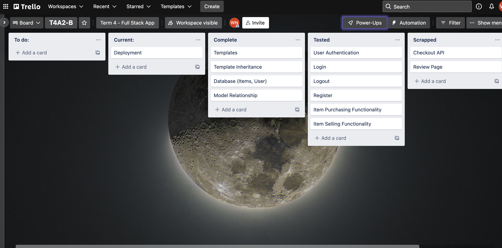

# WilsonNgo_T4A2-B

## Website Link:
https://fast-meadow-06011.herokuapp.com/

## Github Repo:
https://github.com/wilsonlengo/WilsonNgo_T4A2-B

## Tech Stack:
* Python
* Flask
* HTML + Bootstrap
* Heroku
* SQLite3
* Github

## Website Overview:
The tech market web application is a site in which users can list, sell and buy items. When a user account is registered to the database, they will start with $1000. 


## Getting started:

### Clone repo:
https://github.com/wilsonlengo/WilsonNgo_T4A2-B.git

### Set up virtual envrionment:
```
virtualenv <venv_name>
```

### Launch Environment:
```
source venv/bin/activate
```

### Install pip requirements:

```
pip install requirements.txt
```

### Start the application by launching the run.py file in the shopapp directory
```
python run.py
```

For an item to be listed on the market, the user will need to enter in the terminal:
```
python
```
Following that, create a variable for your item (can be anything). After that, utilise the Item() model and fill in the fields like so:
```
<variable name> = Item(name="<item name>", description="<item description>", price="<price>")
```
That should create your item that you wish to list on the market. After that you would just need to add() and commit():
```
db.session.add(<variable name>)
db.session.commit()
```
Success! You have successfully listed an item on the tech market web application and it should be recognised by the database.


## Site Tests

### Testing log out flash:

### Testing failure of valid crediential flash:

### Testing successful registration of account flash:

### Testing the sell modal:

### Testing the successful listing flash:

### Testing more information modal:

### Testing the buy modal:

### Testing successful purchase of item flash:


## Trello Progression

### Day 1

### Day 2

### Day 3

### Day 4

### Day 5



## Website Layout:
NOTE: Due to time constraints I was only able to fulfil the home page, shop/market page, login page and register page.

### Home Page:

### Shop/Market Page:

### Login Page:

### Register Page:


## Dataflow Diagram from Part A

## Application Architecture Diagram from Part A


## Task Delegation Methodology:

I have used agile project management methodology to ensure that the project is completed
in a timely manner. I have used a Trello board to track tasks and have labelled tasks with
difficulty levels, checklists and due dates. As the sole developer all the tasks have been
delegated to myself. 